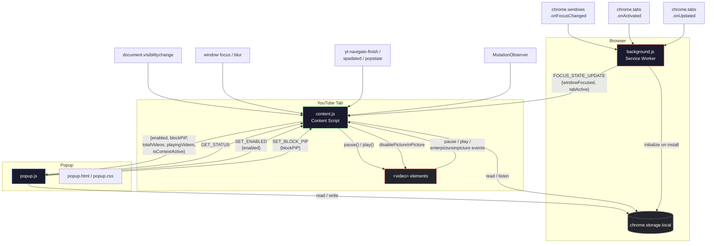
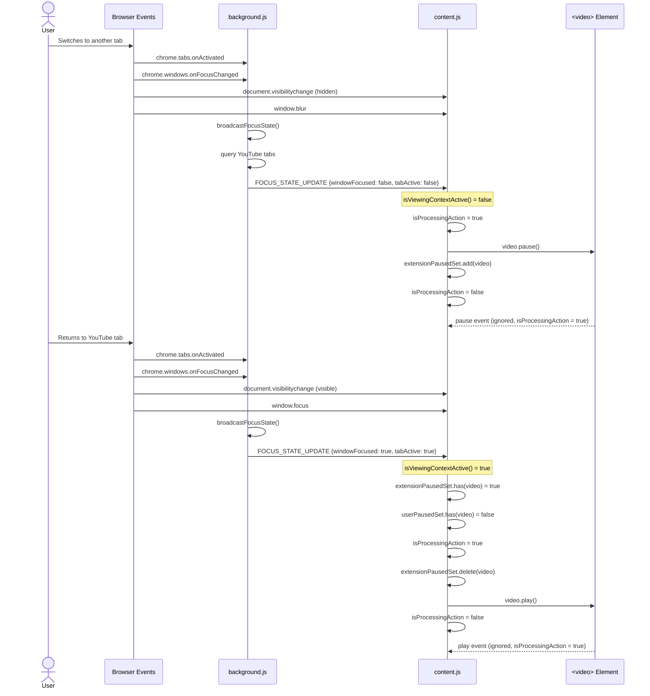
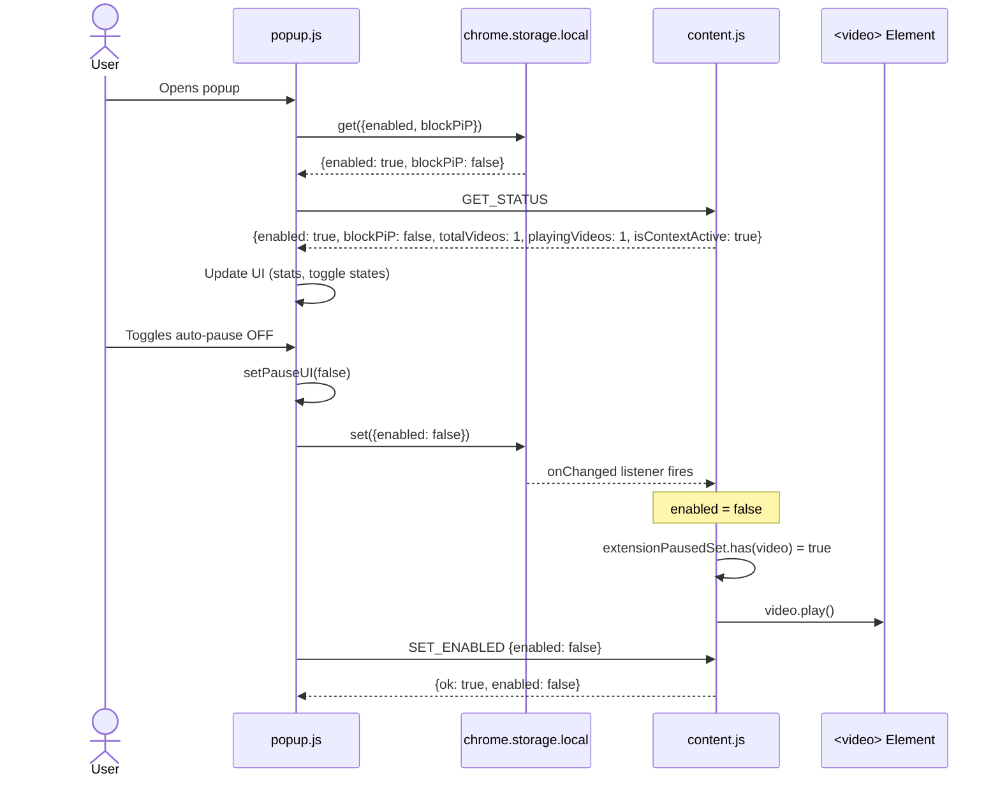
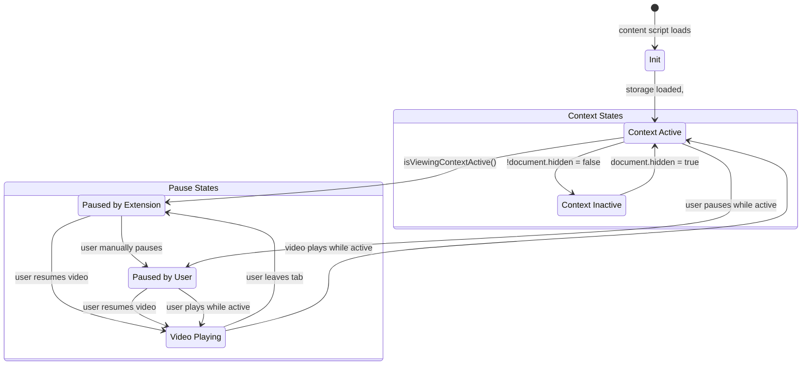
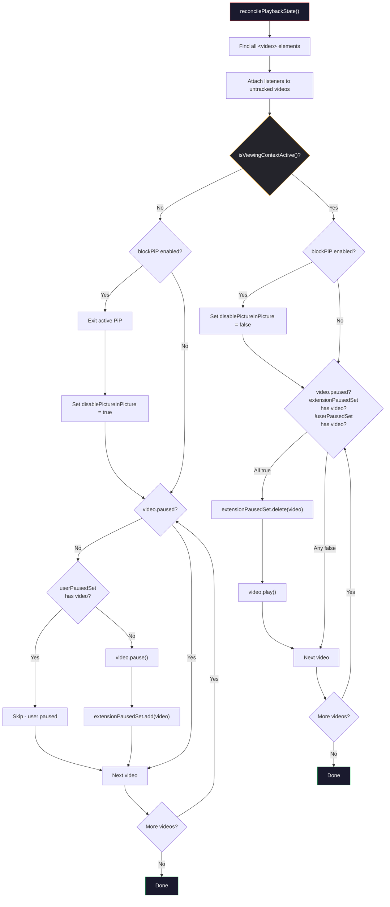

# YouTube Auto-Pause

A Chrome Extension that automatically pauses YouTube videos when you switch tabs or windows and resumes playback when you return — without overriding your manual pauses.

---

## Table of Contents

- [Who This Project Is For](#who-this-project-is-for)
- [Features](#features)
- [Project Structure](#project-structure)
- [Prerequisites](#prerequisites)
- [Installation](#installation)
- [Configuration](#configuration)
- [How to Run](#how-to-run)
- [Usage Examples](#usage-examples)
- [Screenshots & Visual Demo](#screenshots--visual-demo)
- [Architecture](#architecture)
- [Mermaid Support](#mermaid-support)
- [Troubleshooting](#troubleshooting)
- [Contributing](#contributing)
- [License](#license)
- [Contact & Support](#contact--support)

---

## Who This Project Is For

This extension is for anyone who watches YouTube in a browser and wants playback to pause automatically when they switch away from the tab, and resume when they come back. It is useful for:

- Students watching lecture videos who need to tab away for notes
- Developers following tutorial videos while coding in another window
- Anyone who has missed parts of a video because it kept playing in the background

No coding knowledge is required to install or use this extension.

---

## Features

- **Auto-pause on tab switch** - Pauses the video immediately when you switch to a different browser tab.
- **Auto-pause on window switch** - Pauses when you switch to another browser window or application.
- **Auto-resume on return** - Resumes playback only when the extension had previously paused the video.
- **Manual pause protection** - If you pause a video yourself, it will not be resumed automatically when you return.
- **Picture-in-Picture control** - Optional toggle to block PiP when the viewing context is inactive.
- **YouTube SPA support** - Handles YouTube's single-page application navigation (changing videos, browser back/forward, etc.).
- **Dynamic video detection** - Uses a MutationObserver to detect when YouTube replaces or adds `<video>` elements.
- **Live stats** - The popup shows the number of playing and detected videos, plus the current status (ON/OFF).
- **Works across browsers** - Targets modern Chromium-based browsers (Chrome, Edge, Brave, etc.).

---

## Project Structure

```
.
├── manifest.json          # Chrome Extension manifest (Manifest V3)
├── content.js             # Content script injected into YouTube pages
├── background.js          # Service worker that tracks tab and window focus
├── popup.html             # Extension popup UI markup
├── popup.js               # Popup logic (toggle controls, status display)
├── popup.css              # Popup styling
├── icons/
│   ├── icon16.png         # 16x16 extension icon
│   ├── icon48.png         # 48x48 extension icon
│   └── icon128.png        # 128x128 extension icon
├── .vscode/
│   └── settings.json      # VS Code spell-check settings
├── .gitignore
├── AGENTS.md              # Development guidelines for AI coding agents
└── README.md              # This file
```

### File Responsibilities

| File | Role |
|---|---|
| `manifest.json` | Declares the extension name, version, permissions, content scripts, service worker, and popup. Uses Manifest V3. |
| `content.js` | Injected on `*.youtube.com` pages. Tracks video elements, pauses/resumes playback based on visibility and focus, and respects manual user pauses. Communicates with the popup and background script via Chrome messaging. |
| `background.js` | Service worker that listens for tab activation and window focus changes. Broadcasts focus state updates to all open YouTube tabs. Initializes default storage values on install. |
| `popup.html` | Provides the toggle UI for enabling/disabling auto-pause and the PiP block feature, plus live stats display. |
| `popup.js` | Reads and writes settings from `chrome.storage.local`, sends messages to the active YouTube tab, and updates the popup UI. |
| `popup.css` | Dark-themed styling for the popup interface. |

---

## Prerequisites

- **Google Chrome** (or any Chromium-based browser: Edge, Brave, Opera, Vivaldi)
- **No build tools required** - the extension is written in vanilla JavaScript with no dependencies, no bundler, and no compilation step
- A stable internet connection for loading YouTube pages

---

## Installation

### From Source (Developer Mode)

1. **Download or clone the repository**

   ```bash
   git clone https://github.com/Fraded-Panda-25/youtube-auto-pause-pro.git
   ```

   This copies the project files to your local machine.

2. **Open Chrome Extensions page**

   Navigate to `chrome://extensions` in your browser's address bar.

3. **Enable Developer Mode**

   Toggle the **Developer mode** switch in the top-right corner of the Extensions page. This allows you to load unpacked extensions.

4. **Load the unpacked extension**

   Click the **Load unpacked** button in the top-left corner.

5. **Select the project folder**

   Browse to the folder containing `manifest.json` (the root of this repository) and select it. The extension will appear in your extensions list.

6. **Pin the extension (optional)**

   Click the puzzle-piece icon in Chrome's toolbar, find **YouTube Auto-Pause**, and click the pin icon to keep it visible.

The extension is now active and will work automatically on any YouTube page.

---

## Configuration

All settings are managed through the extension popup and are persisted in `chrome.storage.local`.

### Auto-Pause Toggle

- **ON (default):** The extension will pause videos when you leave the YouTube tab or window, and resume them when you return.
- **OFF:** The extension will not interfere with playback. Videos continue playing normally regardless of tab or window focus.

### Picture-in-Picture Block

- **OFF (default):** PiP is allowed normally.
- **ON:** When the viewing context becomes inactive, the extension will exit any active PiP session and temporarily disable PiP on video elements. PiP is re-enabled when the context becomes active again.

### How Settings Are Stored

| Key | Type | Default | Description |
|---|---|---|---|
| `enabled` | `boolean` | `true` | Whether auto-pause/resume is active |
| `blockPiP` | `boolean` | `false` | Whether PiP is blocked when context is inactive |

Settings are stored locally and synced to the content script via `chrome.storage.onChanged` listeners and direct messaging.

---

## How to Run

This extension does not require a build step or development server. Once loaded:

1. Open any YouTube page (e.g., `https://www.youtube.com`).
2. Play a video.
3. Switch to another tab - the video pauses.
4. Switch back - the video resumes (only if the extension paused it).

To test window-switch behavior:

1. Play a video on YouTube.
2. Switch to another application window (Alt+Tab on Windows, Cmd+Tab on macOS).
3. The video pauses.
4. Return to the browser window - the video resumes.

To test manual pause protection:

1. Play a video on YouTube.
2. Pause the video manually (click the pause button).
3. Switch to another tab, then switch back.
4. The video remains paused - the extension does not override your manual pause.

---

## Usage Examples

### Basic Auto-Pause

1. Open a YouTube video page
2. Start playing the video
3. Click on a different browser tab
4. The video pauses automatically
5. Click back on the YouTube tab
6. The video resumes

### Multiple Videos on a Page

The extension detects all `<video>` elements on the page. If a YouTube page contains multiple video elements (e.g., in playlists or embedded videos), all playing videos will be paused and resumed together.

### Popup Status

Click the extension icon in the toolbar to see:

- **Videos Playing** - How many videos are currently playing
- **Videos Detected** - Total `<video>` elements found on the page
- **Status** - Whether auto-pause is ON or OFF

### Disabling the Extension

1. Click the extension icon in the toolbar
2. Toggle the **Auto-pause on switch** switch to OFF
3. The extension stops controlling playback
4. Videos paused by the extension will be resumed when disabled

---

## Screenshots & Visual Demo

### Popup UI - Auto-pause ON (default)

The extension popup appears when you click the toolbar icon. With auto-pause enabled, videos pause when you leave and resume when you return.

<!--  -->

png

- **Auto-pause toggle** is ON (green) - videos will pause on tab/window switch
- **Status** shows ON
- **Stats** display live video counts from the current YouTube page

### Popup UI - Auto-pause OFF

When disabled, the extension does not control playback.

<!--  -->


- **Auto-pause toggle** is OFF (gray) - videos play normally regardless of focus
- **Status** shows OFF

### Popup UI - Picture-in-Picture Block ON

The PiP block toggle prevents Picture-in-Picture when the viewing context is inactive.

<!--  -->


- **Auto-pause** is ON
- **PiP toggle** is ON (green) - PiP will be exited and blocked when you leave
- **Stats** show 2 of 3 videos currently playing

### UI Elements Reference

| Element | Description |
|---|---|
| **Header** | Red gradient play icon, bold title, uppercase subtitle |
| **Auto-pause toggle** | Green = ON (active), gray = OFF (disabled) |
| **PiP toggle** | Green = ON (PiP blocked on leave), gray = OFF (PiP allowed) |
| **Stats row** | Three columns: playing count, detected count, ON/OFF status |
| **Info box** | Static reminder that manual pauses are respected |


## Architecture

The extension uses a three-component architecture: a **background service worker**, a **content script** injected into YouTube pages, and a **popup UI**. Below are diagrams showing how they communicate.

### Component Overview



### Message Flow: Tab Switch

This is the most common scenario - the user switches to another tab and then returns.



### Message Flow: Popup Interaction

When the user opens the popup and toggles settings.



### State Model

The content script maintains the following state to make pause/resume decisions:



### Pausing and Resuming Logic

The core decision flow in `reconcilePlaybackState()`:



---

## Troubleshooting

### The extension is not pausing videos

- Verify the extension is enabled in `chrome://extensions` and the toggle in the popup is ON.
- Check that the content script has loaded: open DevTools on the YouTube page, go to the **Console** tab, and look for any errors.
- Refresh the YouTube page after installing the extension for the first time.

### The extension pauses but does not resume

- If you manually paused the video, the extension will not resume it. This is by design.
- Check the popup stats to confirm extension-paused state is tracked. The extension only resumes videos it previously paused.

### Videos play after disabling the extension

- When you turn the extension OFF, any videos it had paused will be resumed automatically. This ensures you are not left with unexpected silent videos.

### The popup shows dashes for video counts

- This means the content script is not active on the current tab. It only runs on YouTube pages (`*.youtube.com`).
- Navigate to a YouTube page and open the popup again.

### Extension does not work after YouTube navigation

- The extension listens for YouTube SPA navigation events (`yt-navigate-finish`, `spadated`, `popstate`) and uses a MutationObserver to detect DOM changes. If it still does not work, try refreshing the page.

### Extension causes errors on non-YouTube pages

- The content script is only injected on `*.youtube.com/*` pages. It should not run on other sites.
- If you see errors on non-YouTube pages, open the Extensions page and verify the content script match pattern.

---


### Testing Checklist

Before submitting a change, verify these scenarios:

| Scenario | Expected Behavior |
|---|---|
| Switch YouTube tab to another tab | Video pauses |
| Return to YouTube tab | Video resumes (if extension paused it) |
| Switch to another browser window | Video pauses |
| Return to browser window | Video resumes (if extension paused it) |
| Minimize and restore browser | Pauses when visibility/focus signal occurs, resumes on restore |
| User manually pauses video | Video remains paused after return |
| YouTube SPA navigation (click another video, back/forward) | Extension continues working |
| Browser refresh | Extension continues working |
| Multiple YouTube tabs open | State does not leak between tabs |
| Popup on non-YouTube page | No crash, no errors |
| Rapid focus switching | No duplicate or unstable state transitions |

---

## License

This project is licensed under the **Apache License 2.0**. See the [LICENSE](LICENSE) file for full terms.

You may freely use, modify, and distribute this software, provided that:

- You include a copy of the original license.
- You indicate any modifications made to the original code.
- You include the required NOTICE file if one is provided.

For details, visit [apache.org/licenses/LICENSE-2.0](https://www.apache.org/licenses/LICENSE-2.0).

---

## Contact & Support

- **Issues:** Open an issue in the repository's issue tracker for bug reports or feature requests.
- **Repository:** Check the project's repository page for updates and releases.
